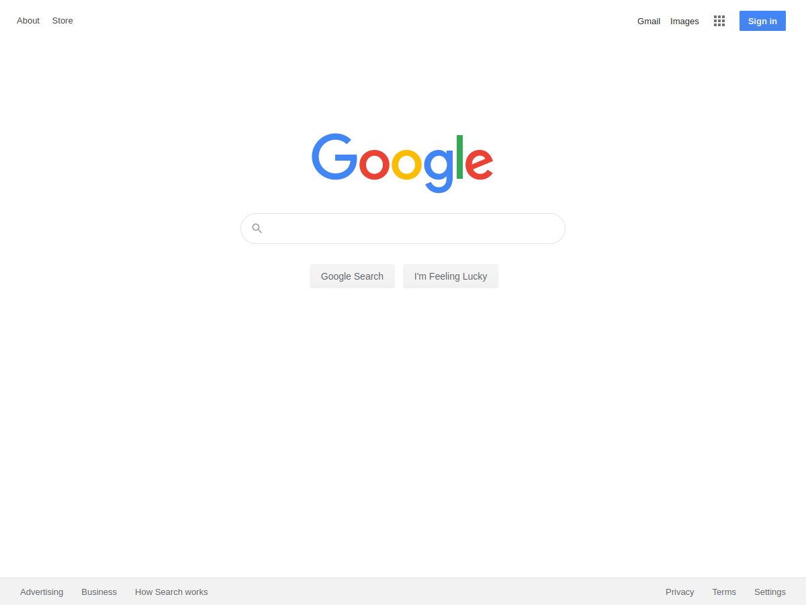
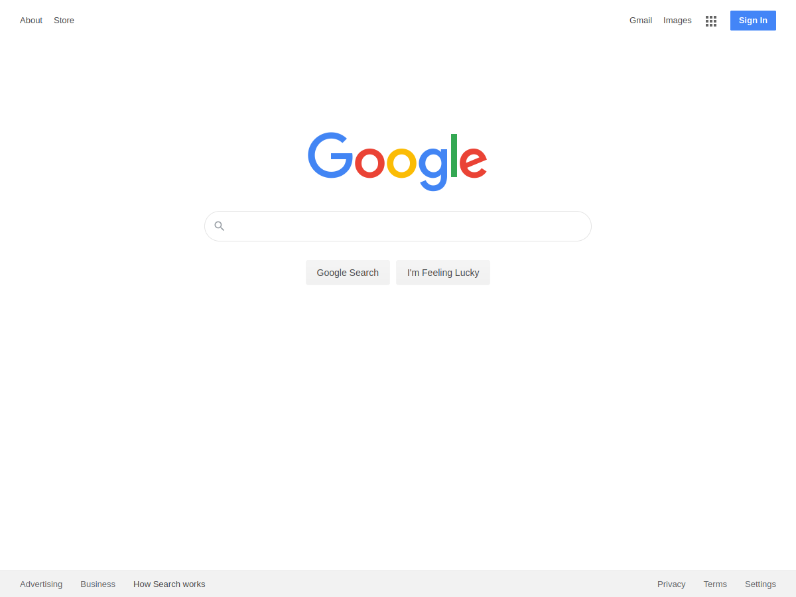

# Project: HTML/CSS

> The goal was to deconstruct the Google Search website, and use HTML & CSS to clone it and make it as similar as posible.

Original Google Search Website

Solution

I also try to follow BEM a CSS naming convention and other css style guides. I run the code through HTML validator and use a linter to review and fix the style issues.

## Built With

- HTML
- CSS

## Live Demo

[Live Demo Link](https://livedemo.com)

## Authors

👤 **Author1**

- Github: [@jubaan](https://github.com/jubaan/)
- Twitter: [@AnoverosJulio](https://twitter.com/AnoverosJulio)
- Linkedin: [linkedin](https://www.linkedin.com/in/julio-a%C3%B1overos-b987a8a0/)

## 🤝 Contributing

Contributions, issues and feature requests are welcome!

Feel free to check the [issues page](https://github.com/jubaan/Project_HTML_CSS/issues?q=is%3Aissue+is%3Aopen+sort%3Aupdated-desc).

## Show your support

Give a ⭐️ if you like this project!

## Acknowledgments

- This is a project from the HTML & CSS Odin Project curriculum
- Validated with:
  - [W3C validator](https://validator.w3.org/)
  - Stickler
  - Styleling

## 📝 License

This project is [MIT](./assets/LICENSE) licensed.
